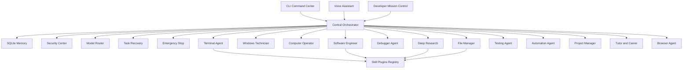

# 🤖 MEKURIA — Ultimate Personal AI Operating Assistant

> *"An advanced autonomous digital agent and operating assistant designed to understand goals and execute end-to-end work safely and reliably."*

---

## 🏛️ Comprehensive 51-Pillar Architecture



---

## 🌟 The 51 Core Capabilities

| Pillar | Subsystem | Description |
|--------|-----------|-------------|
| **1. Advanced AI Brain** | `core/memory.py` | Working, short-term, and long-term SQLite memory with context continuity. |
| **2. Autonomous Agent Mode** | `core/orchestrator.py` | 11-step execution loop: Goal -> Plan -> Act -> Test -> Fix -> Verify -> Report. |
| **3. Full Computer Assistant** | `agents/computer_operator.py` | Screen capture, application lifecycle, window management, and clipboard control. |
| **4. Terminal Command Center** | `agents/terminal_agent.py` | Safe PowerShell, CMD, Git, Docker execution with error detection and retry. |
| **5. Windows Technician** | `agents/technician_agent.py` | Hardware telemetry, RAM/disk analysis, driver & system troubleshooting. |
| **6. Deep Research Engine** | `agents/research_agent.py` | Multi-source investigation (Wikipedia, Google News, academic) with structured dossiers. |
| **7. Web Browser Agent** | `agents/web_browser_agent.py` | URL navigation, HTML text extraction, and page search. |
| **8. Form Filling Agent** | `agents/web_browser_agent.py` | Validates required fields with mandatory confirmation safeguards. |
| **9. Full Software Engineer** | `agents/software_engineer.py` | Scaffolds React, Next.js, FastAPI, Node, Python, and mobile projects. |
| **10. Advanced Debugger** | `agents/debugger.py` | Automated root-cause detection and learned error solution patching. |
| **11. Deployment Engine** | `agents/software_engineer.py` | Prepares cloud deployments and builds containerized artifacts. |
| **12. File Manager** | `agents/file_manager_agent.py` | Recursive search, duplicate detection, and ZIP compression/extraction. |
| **13. Document Intelligence** | `agents/file_manager_agent.py` | Parses TXT, Markdown, CSV, JSON, and supported document formats. |
| **14. Computer Vision** | `agents/computer_operator.py` | Captures high-resolution desktop screenshots for UI inspection. |
| **15. Voice Assistant** | `stt.py`, `tts.py` | Real-time Faster-Whisper hearing & Edge-TTS neural speech synthesis. |
| **16. Notification System** | `agents/automation_agent.py` | Audio and desktop alerts for task completions and warnings. |
| **17. Automation Engine** | `agents/automation_agent.py` | Background threads, scheduled alarms, and periodic system checks. |
| **18. Email Assistant** | `agents/automation_agent.py` | Professional email draft generation and formatting. |
| **19. Calendar Assistant** | `agents/automation_agent.py` | Event summaries and schedule reminder dispatch. |
| **20. Personal Knowledge Base** | `core/memory.py` | Persistent SQLite knowledge repository with semantic tag search. |
| **21. Project Manager** | `agents/project_manager.py` | Task roadmaps, dependency resolution, and percentage completion tracking. |
| **22. Multi-Agent System** | `agents/` | 12 specialized autonomous agents coordinated by a central orchestrator. |
| **23. Testing Agent** | `agents/testing_agent.py` | Python syntax validation and file verification (Never say Done without verification). |
| **24. Security Center** | `core/security.py` | Least-privilege policies, secret masking, and high-risk action confirmation. |
| **25. Emergency Stop** | `core/emergency.py` | Global `STOP MEKURIA` kill-switch that instantly halts all background tasks. |
| **26. System Monitor** | `agents/technician_agent.py` | Real-time CPU, RAM, disk capacity, and process monitoring. |
| **27. Network Diagnostics** | `agents/technician_agent.py` | Ping latency, DNS resolution, and internet connectivity checks. |
| **28. Mobile Development** | `agents/software_engineer.py` | Android, Kotlin, and React Native project assistance. |
| **29. Telegram/Bot Engine** | `agents/software_engineer.py` | Bot scaffolding and backend API creation. |
| **30. UI/UX Designer** | `agents/software_engineer.py` | Generates modern, responsive Tailwind & HTML interfaces. |
| **31. Data Analysis** | `agents/tutor_career_agent.py` | Structured data review and statistical evaluation. |
| **32. Translation Engine** | `agents/tutor_career_agent.py` | Multilingual support with regional voice synthesis. |
| **33. Education Tutor** | `agents/tutor_career_agent.py` | Step-by-step conceptual tutoring and exercise generation. |
| **34. Career Assistant** | `agents/tutor_career_agent.py` | Resume/CV analysis, structure review, and optimization. |
| **35. Unified Smart Search** | `tools.py` | Search across local files, web, Wikipedia, and memory. |
| **36. Task Manager** | `core/orchestrator.py` | Hierarchical subtask decomposition and tracking. |
| **37. Plugin / Skill System** | `skills/manager.py` | Dynamic registration and execution of external tools. |
| **38. API Integrations** | `config.py` | Secure API key management via `.env`. |
| **39. Model Routing** | `core/router.py` | Fast model vs Reasoning model selection based on complexity. |
| **40. Cost Control** | `core/router.py` | Token estimation and model execution tracking. |
| **41. Action Log** | `core/security.py` | Immutable audit logger (`data/audit_log.txt`). |
| **42. Self-Improvement** | `core/memory.py` | Learns from resolved errors and caches solutions. |
| **43. 5 User Control Modes** | `core/modes.py` | CHAT, ASSIST, AGENT, AUTONOMOUS, and SAFE modes. |
| **44. Smart Confirmation** | `core/security.py` | Selective prompting for destructive operations. |
| **45. Personal Macros** | `main.py` | Custom commands (*"Good morning Mekuria"*, *"Work mode"*, *"Secure mode"*). |
| **46. Long-Running Tasks** | `core/state.py` | Background execution with progress preservation. |
| **47. Crash Recovery** | `core/state.py` | Resumes interrupted tasks from the exact step. |
| **48. Local-First Privacy** | `core/memory.py` | Local SQLite storage; secrets never committed. |
| **49. Performance Engine** | `core/router.py` | Fast async audio processing and thread-safe loops. |
| **50. Developer Console** | `ui/console_dashboard.py` | Live mission control dashboard with telemetry and agent status. |
| **51. Operating Principle** | `core/orchestrator.py` | **Understand -> Plan -> Execute -> Observe -> Debug -> Test -> Verify -> Report.** |

---

## 🚀 Quick Start Guide

### 1. Configure Environment
```bash
# Add your Gemini API key to .env
GEMINI_API_KEY=your_key_here
```

### 2. Launch Modes

| Mode | Command / Shortcut | Description |
|------|-------------------|-------------|
| **Interactive CLI** | `python main.py` or [`start_text.bat`](start_text.bat) | Command Center with mode switcher |
| **Voice Mode** | `python main.py --voice` or [`start_voice.bat`](start_voice.bat) | Full speech-to-speech assistant |
| **Autonomous Agent** | `python main.py --agent "Build a school management website"` | Multi-step autonomous execution |
| **Developer Console** | `python main.py --console` or [`start_hud.bat`](start_hud.bat) | Live mission control dashboard |

---

## 🛑 Emergency Stop
At any time, type or say:
```text
STOP MEKURIA
```
All in-flight tasks, terminal commands, and processes will immediately abort.
